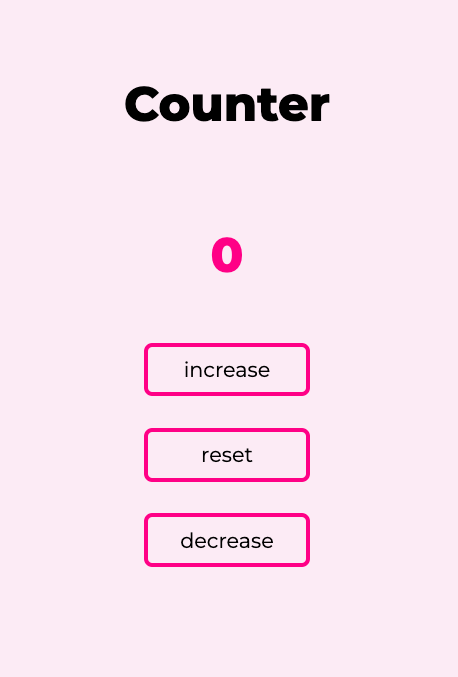
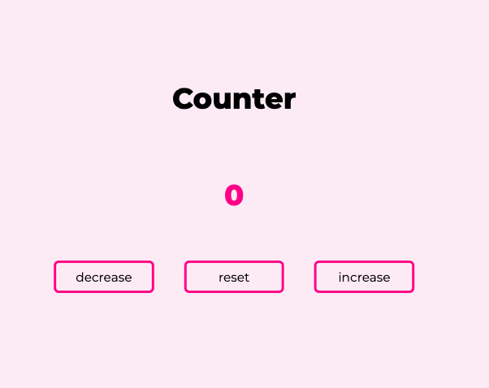

# Counter with JavaScript

JavaScript Project | Counter that decreases, resets or increases the current counter value on display.

## Table of Contents

- [Counter with JavaScript](#counter-with-javascript)
  - [Table of Contents](#table-of-contents)
  - [General Information](#general-information)
  - [Screenshots](#screenshots)
    - [Mobile view](#mobile-view)
    - [Desktop view](#desktop-view)
  - [Technologies](#technologies)
  - [Site Link](#site-link)
  - [What I Learned](#what-i-learned)
  - [Author](#author)

---

## General Information

This is project #2 from [freeCodeCamp](https://www.freecodecamp.org/news/javascript-projects-for-beginners/#how-to-create-a-responsive-navbar)
The project objectives are to create a counter and write conditions that change the color based on positive or negative numbers displayed.

## Screenshots

### Mobile view



### Desktop view



## Technologies

- HTML
- CSS
- JavaScript

## Site Link

>**Live Site: [Generate Random Quote](https://vlorozco.github.io/javascript-counter/)**

---

## What I Learned

It is fun applying the concepts I have learned from [Codecademy](https://www.codecademy.com/learn) into a project. This project contains a higher order function that loops through each button when clicked, that will change the counter value and color based on particular conditions.

Here is a code snippet of the event listener and coinciding function:

```js
// Event listeners per button
buttons.forEach(button => button.addEventListener('click', changeCounterValue));

function changeCounterValue(event) {
  var eventTarget = event.target;

  // Increase, decrease or reset counter value and display updated count value
  if(eventTarget == decrease){
    count--;
    counterValue.innerHTML = count;
  } else if(eventTarget == increase){
    count++;
    counterValue.innerHTML = count;
  } else {
    count = 0;
    counterValue.innerHTML = count;
  }

  // change color of counter value based on negative or positive digit
  if(count < 0){
    counterValue.style.color = "red";
  } else if(count > 0){
    counterValue.style.color = "green";
  } else {
    counterValue.style.color = "deeppink";
  }
}
```

---

## Author

- Github - [Veronica L. Orozco](https://github.com/VLOrozco)
- Frontend Mentor - [@VLOrozco](https://www.frontendmentor.io/profile/VLOrozco)
- Codecademy - [orozcov3](https://www.codecademy.com/profiles/orozcoV3)
